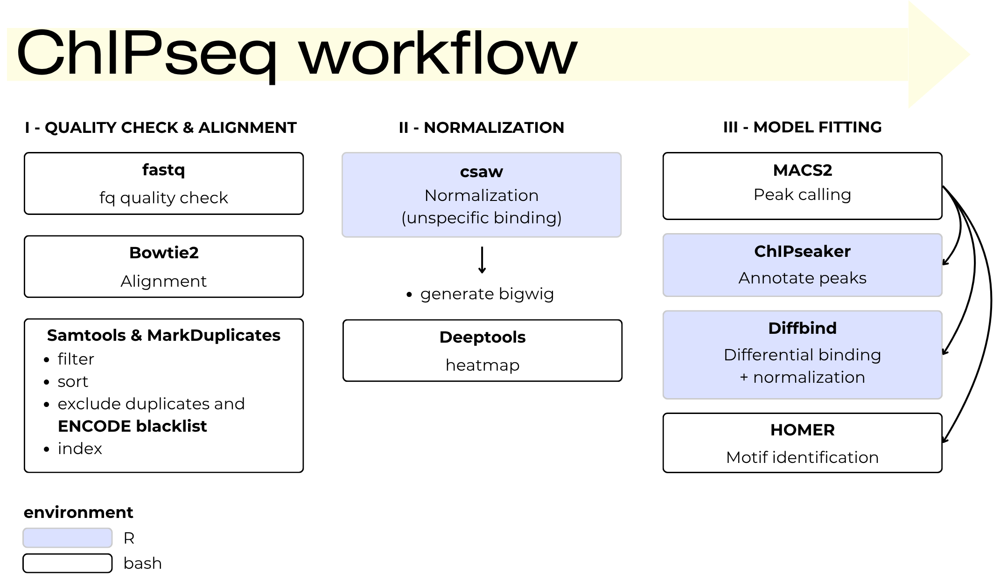

# ChIPseq analysis in PanasyukLab
> *This pipeline is underconstruction*

A step by step description of my ChIPseq pipeline. 

 

## Quality check & alignment
### *Quality check*
### *Alignment with Bowtie2*
### *Ordering & cleaning the output*
- mark and exclude duplicates
- exclude ENCODE blacklist
- sort bam
- index bam
## Normalization step
- csaw normalization (for unspecific binding): very useful for big wig normalization and plotting heatmap
## Model fitting 
### *Peak calling with MACS2*
### *Differential binding*
'diffbind' package to indentify differential peaks between conditions. 
> *WARNING: pipeline underconstruction*
### *Annotatepeaks*
### *Motif identitfication & other tools - HOMER*
